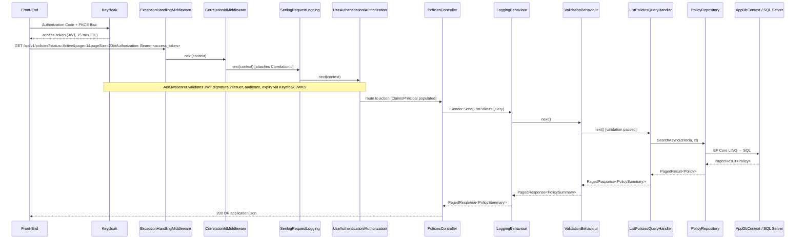
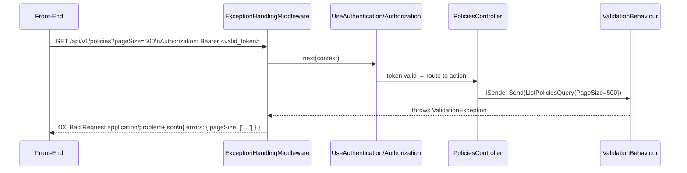
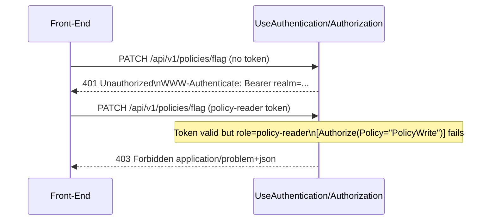

# System Architecture — Policy Management BFF Service

- **Date:** 2026-06-16
- **Status:** Accepted
- **Version:** 1.0

---

## Overview

The Policy Management BFF (Backend-for-Frontend) service is a .NET 10 / ASP.NET Core Web API that sits between the Policy Overview Dashboard front-end and downstream systems (SQL Server database, optional in-process cache, optional Kafka message broker). It aggregates and shapes insurance policy data for direct front-end consumption, exposing four REST endpoints: paginated policy listing with filtering and search, single-policy retrieval, bulk flag-for-review, and aggregated summary statistics.

The service is implemented as a Clean Architecture (Onion) system with four projects. All inter-layer dependencies point inward. The API layer acts exclusively as a BFF translation surface — it maps HTTP contracts to application use-cases and never contains business logic. Domain invariants are encoded on the `Policy` entity. Application handlers orchestrate use-cases via MediatR, calling domain methods and persisting through repository interfaces. Infrastructure provides all EF Core, SQL Server, and external-service implementations.

---

## Layer Boundaries

| Layer | Project | Responsibilities |
|---|---|---|
| **Domain** | `PolicyManagement.Domain` | `Policy` entity and its state-transition methods; `PolicyStatus` and `LineOfBusiness` enumerations; value objects (`PolicyNumber`); domain exceptions (`DomainException`); repository interfaces (`IPolicyRepository`); domain events |
| **Application** | `PolicyManagement.Application` | CQRS commands and queries via MediatR; FluentValidation validators; MediatR pipeline behaviours (`ValidationBehaviour`, `LoggingBehaviour`); application-level ports (`IUnitOfWork`); DTOs returned from handlers; `AddApplication()` DI extension |
| **Infrastructure** | `PolicyManagement.Infrastructure` | `AppDbContext`; EF Core entity configurations; `PolicyRepository`; `UnitOfWork`; `AuditSaveChangesInterceptor`; data seeder (200+ policy rows); `AddInfrastructure()` DI extension |
| **API** | `PolicyManagement.Api` | `PoliciesController`; request/response contract records; `ExceptionHandlingMiddleware`; `CorrelationIdMiddleware`; Serilog bootstrap; health-check endpoints; Swagger/Scalar; `Program.cs` DI wiring |

---

## Dependency Rules

```
PolicyManagement.Api            → PolicyManagement.Application
PolicyManagement.Application    → PolicyManagement.Domain
PolicyManagement.Infrastructure → PolicyManagement.Domain
PolicyManagement.Infrastructure → PolicyManagement.Application   (interface contracts only)
PolicyManagement.Api            → PolicyManagement.Infrastructure (Program.cs registration only)
```

No other cross-project references are permitted. The domain layer has zero NuGet or framework dependencies. The application layer must not reference `Microsoft.AspNetCore.*`, EF Core, or any infrastructure type.

---

## Component Diagram

```mermaid
graph TD
    FE["Policy Overview Dashboard\n(Front-End)"]

    subgraph BFF["PolicyManagement.Api  (BFF)"]
        MC["PoliciesController"]
        EH["ExceptionHandlingMiddleware"]
        CI["CorrelationIdMiddleware"]
        HC["Health Checks\n/health/live\n/health/ready"]
    end

    subgraph APP["PolicyManagement.Application"]
        LPQ["ListPoliciesQuery\nListPoliciesQueryHandler"]
        GPQ["GetPolicyByIdQuery\nGetPolicyByIdQueryHandler"]
        FPC["FlagPoliciesCommand\nFlagPoliciesCommandHandler"]
        GSQ["GetSummaryQuery\nGetSummaryQueryHandler"]
        VB["ValidationBehaviour"]
        LB["LoggingBehaviour"]
    end

    subgraph DOM["PolicyManagement.Domain"]
        PE["Policy entity"]
        EN["PolicyStatus enum\nLineOfBusiness enum"]
        RI["IPolicyRepository interface"]
        DE["DomainException"]
    end

    subgraph INF["PolicyManagement.Infrastructure"]
        PR["PolicyRepository"]
        DB["AppDbContext\n(EF Core 9)"]
        AI["AuditSaveChangesInterceptor"]
        DS["DataSeeder"]
    end

    SQLSERVER[("SQL Server 2022")]
    CACHE["IMemoryCache\n(in-process)"]
    KAFKA["Kafka Broker\n(bonus)"]
    KC["Keycloak 24+\n(Identity Provider)"]

    FE -->|"1. Redirect to login"| KC
    KC -->|"2. Authorization code"| FE
    FE -->|"3. Code → tokens\n(PKCE exchange)"| KC
    FE -->|"4. Bearer JWT"| EH
    EH --> CI
    CI --> MC
    MC -->|ISender.Send| LB
    LB --> VB
    VB --> LPQ
    VB --> GPQ
    VB --> FPC
    VB --> GSQ
    LPQ --> RI
    GPQ --> RI
    FPC --> PE
    FPC --> RI
    GSQ --> RI
    PR -.->|implements| RI
    PR --> DB
    DB --> AI
    DB --> SQLSERVER
    DS --> DB
    APP -->|optional cache read/write| CACHE
    FPC -.->|bonus: publish event| KAFKA
    BFF -->|JWKS fetch (startup + key rotation)| KC
```

---

## Request Flow — Typical Query



---

## Request Flow — Validation Failure



## Request Flow — Unauthenticated / Unauthorised



---

## Use-Case to Handler Mapping

| HTTP Operation | MediatR Type | Handler |
|---|---|---|
| `GET /api/v1/policies` | Query | `ListPoliciesQueryHandler` |
| `GET /api/v1/policies/{id}` | Query | `GetPolicyByIdQueryHandler` |
| `GET /api/v1/policies/summary` | Query | `GetPolicySummaryQueryHandler` |
| `PATCH /api/v1/policies/flag` | Command | `FlagPoliciesCommandHandler` |

---

## Application Layer — CQRS Structure

```
Application/
└── Policies/
    ├── Commands/
    │   └── FlagPolicies/
    │       ├── FlagPoliciesCommand.cs           # record: IRequest<FlagPoliciesResponse>
    │       ├── FlagPoliciesCommandHandler.cs    # internal sealed
    │       └── FlagPoliciesCommandValidator.cs  # non-empty array, max 100 ids
    └── Queries/
        ├── ListPolicies/
        │   ├── ListPoliciesQuery.cs             # record with all filter/sort/page params
        │   ├── ListPoliciesQueryHandler.cs
        │   ├── ListPoliciesQueryValidator.cs    # pageSize ≤ 100, valid enum values
        │   └── PolicySummaryDto.cs              # lean list-item DTO
        ├── GetPolicyById/
        │   ├── GetPolicyByIdQuery.cs
        │   ├── GetPolicyByIdQueryHandler.cs
        │   └── PolicyDto.cs                     # full policy DTO
        └── GetPolicySummary/
            ├── GetPolicySummaryQuery.cs
            ├── GetPolicySummaryQueryHandler.cs
            └── PolicySummaryStatsDto.cs
```

### MediatR Pipeline Order

```
LoggingBehaviour  (outermost — measures total elapsed time)
  └── ValidationBehaviour  (throws ValidationException → 400)
        └── Handler
```

---

## Domain Model

### Policy Entity

The `Policy` aggregate root is the sole domain entity in this service. It enforces all business invariants through methods; direct property mutation from outside the entity is not permitted.

| Property | C# Type | Notes |
|---|---|---|
| `Id` | `string` | UUID string, surrogate PK |
| `PolicyNumber` | `string` | Unique business key, `POL-XXXXXX` format |
| `PolicyholderName` | `string` | Insured party name |
| `LineOfBusiness` | `LineOfBusiness` (enum) | Property, Casualty, A&H, Marine |
| `Status` | `PolicyStatus` (enum) | Active, Expired, Pending, Cancelled |
| `PremiumAmount` | `decimal` | Range 1,000 – 5,000,000; stored `decimal(18,2)` |
| `Currency` | `string` | ISO 4217: USD, SGD, HKD, AUD, JPY, THB |
| `EffectiveDate` | `DateOnly` | Coverage start |
| `ExpiryDate` | `DateOnly` | Coverage end |
| `Region` | `string` | One of eight APAC values |
| `Underwriter` | `string` | Assigned underwriter name |
| `FlaggedForReview` | `bool` | Default: false; set via `FlagForReview()` method |
| `CreatedAt` | `DateTime` | UTC; set by `AuditSaveChangesInterceptor` on insert |
| `UpdatedAt` | `DateTime` | UTC; set by `AuditSaveChangesInterceptor` on update |

### Domain Behaviour Methods

| Method | Invariant enforced |
|---|---|
| `FlagForReview()` | No-op if already flagged (idempotent); raises `PolicyFlaggedForReviewEvent` |
| _(future)_ `Cancel(reason)` | Throws `DomainException` if already cancelled |
| _(future)_ `Expire()` | Throws `DomainException` if not currently active |

### Domain Events

| Event | Raised by | Payload |
|---|---|---|
| `PolicyFlaggedForReviewEvent` | `Policy.FlagForReview()` | `PolicyId`, `FlaggedAt` |

---

## Database Schema

### Table: `Policies`

| Column | SQL Type | Constraints | Notes |
|---|---|---|---|
| `PolicyId` | `nvarchar(50)` | PK (`PK_Policies`), NOT NULL | UUID string |
| `PolicyNumber` | `nvarchar(20)` | NOT NULL, Unique (`IX_Policies_PolicyNumber_U`) | Format: `POL-XXXXXX` |
| `PolicyholderName` | `nvarchar(200)` | NOT NULL | |
| `LineOfBusiness` | `nvarchar(20)` | NOT NULL | Stored as string enum value |
| `Status` | `nvarchar(20)` | NOT NULL | Stored as string enum value |
| `PremiumAmount` | `decimal(18,2)` | NOT NULL | Never `float` or `money` |
| `Currency` | `nvarchar(3)` | NOT NULL | ISO 4217; one of USD/SGD/HKD/AUD/JPY/THB |
| `EffectiveDate` | `date` | NOT NULL | |
| `ExpiryDate` | `date` | NOT NULL | |
| `Region` | `nvarchar(50)` | NOT NULL | One of eight APAC values |
| `Underwriter` | `nvarchar(200)` | NOT NULL | |
| `FlaggedForReview` | `bit` | NOT NULL, DEFAULT 0 | |
| `CreatedAt` | `datetime2` | NOT NULL | Set by audit interceptor |
| `UpdatedAt` | `datetime2` | NOT NULL | Set by audit interceptor |

### Indexes

| Index name | Columns | Type | Rationale |
|---|---|---|---|
| `PK_Policies` | `PolicyId` | Clustered PK | Surrogate key lookup |
| `IX_Policies_PolicyNumber_U` | `PolicyNumber` | Unique non-clustered | Business key lookup, uniqueness enforcement |
| `IX_Policies_Status` | `Status` | Non-clustered | Filter by status (most frequent filter) |
| `IX_Policies_LineOfBusiness` | `LineOfBusiness` | Non-clustered | Filter by line of business |
| `IX_Policies_Region` | `Region` | Non-clustered | Filter by region |
| `IX_Policies_EffectiveDate` | `EffectiveDate` | Non-clustered | Date range filter and sort |
| `IX_Policies_ExpiryDate` | `ExpiryDate` | Non-clustered | Expiring-soon query in summary endpoint |
| `IX_Policies_FlaggedForReview` | `FlaggedForReview` | Non-clustered | Filtered index candidate for review queue |

> Composite indexes may be added once query patterns are profiled against real data volumes. The initial index set favours single-column selectivity.

### Enum Storage Convention

Both `Status` and `LineOfBusiness` are stored as `nvarchar` strings, not integers. This makes the schema human-readable in the database and decoupled from C# enum ordinal values.

```sql
-- Example stored values
Status          = 'Active' | 'Expired' | 'Pending' | 'Cancelled'
LineOfBusiness  = 'Property' | 'Casualty' | 'A&H' | 'Marine'
```

### Audit Timestamp Strategy

`CreatedAt` and `UpdatedAt` are never set by API consumers or domain code. They are set exclusively by `AuditSaveChangesInterceptor` in the Infrastructure layer, which hooks into EF Core's `SavingChanges` event.

---

## API Contract

### Base URL

```
/api/v1/
```

URL-path versioning. Default version is `1.0`. Responses carry the `api-supported-versions` header.

### Endpoints

| Method | Path | Handler | Required role | Success status |
|---|---|---|---|---|
| `GET` | `/api/v1/policies` | `ListPoliciesQueryHandler` | `policy-reader` or `policy-admin` | `200 OK` |
| `GET` | `/api/v1/policies/summary` | `GetPolicySummaryQueryHandler` | `policy-reader` or `policy-admin` | `200 OK` |
| `GET` | `/api/v1/policies/{id}` | `GetPolicyByIdQueryHandler` | `policy-reader` or `policy-admin` | `200 OK` |
| `PATCH` | `/api/v1/policies/flag` | `FlagPoliciesCommandHandler` | **`policy-admin` only** | `200 OK` |
| `GET` | `/health/live` | Health middleware | Anonymous | `200 OK` |
| `GET` | `/health/ready` | Health middleware | Anonymous | `200 OK` |

> **Route ordering note (R-01):** The literal routes `/summary` and `/flag` must be declared before the parameterised `/{id}` route in the controller to prevent ASP.NET Core routing from treating the string `"summary"` or `"flag"` as a policy ID. This is verified by integration tests.

### Pagination Query Parameters (`GET /api/v1/policies`)

| Parameter | Type | Default | Max | Description |
|---|---|---|---|---|
| `page` | `integer` | `1` | — | 1-based page number |
| `pageSize` | `integer` | `20` | `100` | Items per page; >100 → `400` |
| `sortBy` | `string` | `createdAt` | — | Field name to sort by |
| `sortDirection` | `asc` \| `desc` | `asc` | — | Sort direction |
| `status` | enum string | — | — | Active, Expired, Pending, Cancelled |
| `lineOfBusiness` | enum string | — | — | Property, Casualty, A&H, Marine |
| `region` | `string` | — | — | One of eight APAC values |
| `effectiveDateFrom` | `date` | — | — | Inclusive lower bound |
| `effectiveDateTo` | `date` | — | — | Inclusive upper bound |
| `search` | `string` | — | — | Free-text across policyNumber, policyholderName, underwriter |

> **Sort parameter decision (R-02):** The two-parameter convention (`sortBy` + `sortDirection`) is adopted instead of the comma-delimited `sort=field,dir` format specified in the raw requirements. This is more OpenAPI-idiomatic, aligns with the project's contract-first skill, and allows each parameter to be individually documented and validated. See [ADR-008](adr/ADR-008-sort-parameter-convention.md).

### Paginated Response Shape

```
PagedResponse<PolicySummary>
├── data: PolicySummary[]
│     ├── id
│     ├── policyNumber
│     ├── policyholderName
│     ├── lineOfBusiness
│     ├── status
│     ├── premiumAmount
│     ├── currency
│     ├── effectiveDate
│     ├── expiryDate
│     ├── region
│     ├── underwriter
│     └── flaggedForReview
└── pagination: PaginationMeta
      ├── page
      ├── pageSize
      ├── totalCount
      └── totalPages
```

### Summary Response Shape

```
PolicySummaryStats
├── countsByStatus: { Active: n, Expired: n, Pending: n, Cancelled: n }
├── totalPremiumByLineOfBusiness:
│     [ { lineOfBusiness: string, currency: string, totalPremium: decimal } ]
│     (grouped by both lineOfBusiness AND currency — see ADR-009)
└── expiringSoonCount: integer   (policies expiring within 30 days — see ADR-009)
```

### Bulk Flag Request/Response Shape

```
FlagPoliciesRequest
└── policyIds: string[]   (1–100 IDs; empty array → 400)

FlagPoliciesResponse
├── flaggedCount: integer
├── flaggedIds: string[]
└── notFoundIds: string[]   (partial-success — see ADR-007)
```

### Error Response Shape (RFC 9457 ProblemDetails)

All error responses use `Content-Type: application/problem+json`.

| Status | `title` | `detail` present | `errors` map present |
|---|---|---|---|
| `400` | `Bad Request` | Yes | Yes (camelCase keys) |
| `401` | `Unauthorized` | Yes | No |
| `403` | `Forbidden` | Yes | No |
| `404` | `Not Found` | Yes | No |
| `422` | `Unprocessable Entity` | Yes | No |
| `500` | `Internal Server Error` | No (null) | No |

---

## Cross-Cutting Concerns

### Error Handling Pipeline

```
Request
  │
  ▼
ExceptionHandlingMiddleware  ← outermost; catches all unhandled exceptions → ProblemDetails
  │
  ▼
CorrelationIdMiddleware      ← attaches / generates X-Correlation-Id header
  │
  ▼
SerilogRequestLogging        ← per-request structured log entry
  │
  ▼
UseAuthentication            ← validates JWT Bearer token via Keycloak JWKS
  │                             → 401 if missing/invalid/expired
  ▼
UseAuthorization             ← evaluates named authorization policies (PolicyRead, PolicyWrite)
  │                             → 403 if authenticated but wrong role
  ▼
PoliciesController
  │  ISender.Send(command/query)
  ▼
MediatR Pipeline
  ├── LoggingBehaviour       ← request timing
  ├── ValidationBehaviour    ← FluentValidation; throws ValidationException → 400
  └── Handler
        ├── NotFoundException   → 404
        ├── DomainException     → 422
        └── unhandled           → 500
```

### Exception → HTTP Status Mapping

| Exception type | HTTP status | `detail` |
|---|---|---|
| `FluentValidation.ValidationException` | `400` | `"One or more validation errors occurred."` + `errors` map |
| `NotFoundException` | `404` | `"{Entity} with identifier '{key}' was not found."` |
| `DomainException` | `422` | Exception message |
| `UnauthorizedAccessException` | `403` | `"You do not have permission to perform this action."` |
| `OperationCanceledException` | `499` | (no body) |
| Any other `Exception` | `500` | `null` |

### Logging

| Concern | Decision |
|---|---|
| Library | Serilog with `UseSerilog()` bootstrap |
| Output | Structured JSON to stdout (Docker-friendly) |
| Request log | `UseSerilogRequestLogging` enriched with `RequestHost`, `RequestScheme`, `UserAgent` |
| Correlation ID | `X-Correlation-Id` header; pushed to `LogContext` and reflected in all log entries for the request |
| Sensitive data | Never log PII, connection strings, or policy document contents |
| Log levels | `Information` for business events; `Warning` for expected errors (404, 422, 400); `Error` for unexpected faults |

### Health Checks

| Endpoint | Tags | Liveness / Readiness | Checks |
|---|---|---|---|
| `GET /health/live` | `live` | Liveness | Process-alive (trivial pass) |
| `GET /health/ready` | `ready` | Readiness | `AppDbContext` + SQL Server connectivity |

Health endpoints are excluded from Swagger and API versioning. They do not require authentication.

### Authentication

See [ADR-010](adr/ADR-010-keycloak-jwt-bearer-authentication.md) for the full decision record.

| Concern | Decision |
|---|---|
| Identity provider | **Keycloak 24+** (self-hosted Docker service, free, Apache 2.0) |
| Auth flow | **OAuth2 Authorization Code + PKCE** — front-end SPA authenticates; BFF only validates |
| Token type | JWT Bearer (RS256 signed by Keycloak; public key fetched from JWKS endpoint) |
| Token validation | `Microsoft.AspNetCore.Authentication.JwtBearer` — standard .NET middleware, no Keycloak SDK |
| Roles | `policy-reader`: read endpoints; `policy-admin`: read + flag (`PATCH /flag`) |
| Role extraction | `KeycloakRolesClaimsTransformation` flattens `realm_access.roles` → `ClaimTypes.Role` |
| Authorization policies | `PolicyRead` (policy-reader \| policy-admin); `PolicyWrite` (policy-admin only); defined once in `Program.cs` |
| Anonymous endpoints | `/health/live`, `/health/ready` — no auth required |
| Integration tests | `TestAuthHandler` replaces JWT Bearer in tests; Keycloak not started in CI |
| HTTPS metadata | Required in production (`RequireHttpsMetadata = true`); relaxed in Development only |

### Configuration

All configuration uses the Options pattern with `ValidateOnStart()`. Misconfiguration causes process exit at startup.

| Section | Environment variable | Purpose |
|---|---|---|
| `ConnectionStrings:DefaultConnection` | `ConnectionStrings__DefaultConnection` | SQL Server connection string |
| `Keycloak:Authority` | `Keycloak__Authority` | Keycloak realm URL (e.g. `http://keycloak:8080/realms/policy-mgmt`) |
| `Keycloak:Audience` | `Keycloak__Audience` | Expected JWT audience (`policy-management-api`) |
| `Cache:SlidingExpirationSeconds` | `Cache__SlidingExpirationSeconds` | IMemoryCache sliding window |
| `Cache:AbsoluteExpirationSeconds` | `Cache__AbsoluteExpirationSeconds` | IMemoryCache absolute cap |
| `Serilog:MinimumLevel:Default` | `Serilog__MinimumLevel__Default` | Log verbosity |

Secrets are never committed to source control. Local development uses `dotnet user-secrets`. CI/CD uses environment-variable injection.

---

## Caching Strategy (Bonus)

| Cache target | Key pattern | Expiry | Invalidation trigger |
|---|---|---|---|
| Policy list pages | `v1:policies:list:{hash-of-query-params}` | 1 min absolute | Any `FlagPoliciesCommand` execution |
| Individual policy | `v1:policy:{id}` | 5 min sliding | `FlagPoliciesCommand` touching that ID |
| Summary stats | `v1:policies:summary` | 5 min sliding | Any `FlagPoliciesCommand` execution |

Cache implementation: `IMemoryCache` (single-instance). Key version prefix `v1:` allows global invalidation if a schema change warrants it.

The summary and list caches are invalidated by the `FlagPoliciesCommandHandler` after each successful persist. Individual policy cache entries are evicted by ID on flag.

---

## Kafka Event Streaming (Bonus)

### Event: `PolicyFlaggedForReview`

Published by `FlagPoliciesCommandHandler` to the `policy-flagged` topic after a successful database commit.

```json
{
  "eventId":   "<uuid>",
  "eventType": "PolicyFlaggedForReview",
  "occurredAt": "2026-06-16T09:00:00Z",
  "payload": {
    "policyId":    "<uuid>",
    "policyNumber": "POL-123456",
    "flaggedAt":   "2026-06-16T09:00:00Z"
  }
}
```

### Event: `PolicyStatusChanged` (consumed)

Consumed from the `policy-status-changed` topic. The consumer updates the `Policy.Status` field.

Idempotency: the consumer stores processed `eventId` values. A duplicate `eventId` causes a no-op return without re-applying the state change.

```json
{
  "eventId":   "<uuid>",
  "eventType": "PolicyStatusChanged",
  "occurredAt": "2026-06-16T09:00:00Z",
  "payload": {
    "policyId":  "<uuid>",
    "newStatus": "Cancelled"
  }
}
```

---

## Folder Structure

```
src/
├── PolicyManagement.Domain/
│   ├── Entities/
│   │   └── Policy.cs
│   ├── Enumerations/
│   │   ├── PolicyStatus.cs
│   │   └── LineOfBusiness.cs
│   ├── Events/
│   │   └── PolicyFlaggedForReviewEvent.cs
│   ├── Repositories/
│   │   └── IPolicyRepository.cs
│   └── Exceptions/
│       └── DomainException.cs
│
├── PolicyManagement.Application/
│   ├── Policies/
│   │   ├── Commands/
│   │   │   └── FlagPolicies/
│   │   │       ├── FlagPoliciesCommand.cs
│   │   │       ├── FlagPoliciesCommandHandler.cs
│   │   │       └── FlagPoliciesCommandValidator.cs
│   │   └── Queries/
│   │       ├── GetPolicyById/
│   │       │   ├── GetPolicyByIdQuery.cs
│   │       │   ├── GetPolicyByIdQueryHandler.cs
│   │       │   └── PolicyDto.cs
│   │       ├── ListPolicies/
│   │       │   ├── ListPoliciesQuery.cs
│   │       │   ├── ListPoliciesQueryHandler.cs
│   │       │   ├── ListPoliciesQueryValidator.cs
│   │       │   └── PolicySummaryDto.cs
│   │       └── GetPolicySummary/
│   │           ├── GetPolicySummaryQuery.cs
│   │           ├── GetPolicySummaryQueryHandler.cs
│   │           └── PolicySummaryStatsDto.cs
│   ├── Common/
│   │   ├── Interfaces/
│   │   │   └── IUnitOfWork.cs
│   │   ├── Behaviours/
│   │   │   ├── ValidationBehaviour.cs
│   │   │   └── LoggingBehaviour.cs
│   │   └── Exceptions/
│   │       └── NotFoundException.cs
│   └── DependencyInjection.cs
│
├── PolicyManagement.Infrastructure/
│   ├── Persistence/
│   │   ├── AppDbContext.cs
│   │   ├── AuditSaveChangesInterceptor.cs
│   │   ├── UnitOfWork.cs
│   │   ├── Configurations/
│   │   │   └── PolicyConfiguration.cs
│   │   ├── Repositories/
│   │   │   └── PolicyRepository.cs
│   │   ├── Migrations/
│   │   │   └── (generated by dotnet ef migrations add InitialSchema)
│   │   └── Seed/
│   │       └── DataSeeder.cs
│   └── DependencyInjection.cs
│
└── PolicyManagement.Api/
    ├── Controllers/
    │   └── PoliciesController.cs
    ├── Middleware/
    │   ├── ExceptionHandlingMiddleware.cs
    │   └── CorrelationIdMiddleware.cs
    ├── Security/
    │   └── KeycloakRolesClaimsTransformation.cs
    ├── Options/
    │   └── KeycloakOptions.cs
    ├── Contracts/
    │   ├── Requests/
    │   │   └── FlagPoliciesRequest.cs
    │   └── Responses/
    │       ├── PolicyResponse.cs
    │       ├── PolicySummaryResponse.cs
    │       ├── FlagPoliciesResponse.cs
    │       └── PolicySummaryStatsResponse.cs
    └── Program.cs

tests/
├── PolicyManagement.Domain.Tests/
├── PolicyManagement.Application.Tests/
│   └── Policies/
│       ├── Commands/
│       │   └── FlagPoliciesCommandHandlerTests.cs
│       └── Queries/
│           ├── GetPolicyByIdQueryHandlerTests.cs
│           ├── ListPoliciesQueryHandlerTests.cs
│           └── GetPolicySummaryQueryHandlerTests.cs
├── PolicyManagement.Infrastructure.Tests/
│   └── Repositories/
│       └── PolicyRepositoryTests.cs
└── PolicyManagement.Api.Tests/
    ├── Controllers/
    │   └── PoliciesControllerTests.cs
    └── Common/
        ├── ApiWebApplicationFactory.cs
        └── SeedData.cs

keycloak/
└── realm-export.json              ← pre-configured realm (policy-mgmt), clients, roles, seed users

docs/
├── architecture.md              ← this document
├── analysis/
│   └── policy-management-bff-analysis.md
├── openapi/
│   └── policy-management.yaml  ← OpenAPI 3.x source of truth
└── adr/
    ├── ADR-001-clean-architecture-cqrs.md
    ├── ADR-002-sql-server-ef-core.md
    ├── ADR-003-contract-first-openapi.md
    ├── ADR-004-problemdetails-error-contract.md
    ├── ADR-005-url-path-versioning.md
    ├── ADR-006-imemorycache-caching.md
    ├── ADR-007-bulk-flag-partial-success.md
    ├── ADR-008-sort-parameter-convention.md
    ├── ADR-009-multicurrency-premium-grouping.md
    └── ADR-010-keycloak-jwt-bearer-authentication.md
```

---

## Tradeoffs

| Decision | Chosen Approach | Alternative Considered | Reason |
|---|---|---|---|
| Architecture pattern | Clean Architecture (Onion) with four projects | Modular Monolith with vertical slices; Microservices | Clean Architecture gives the clearest separation of domain purity from infrastructure for an insurance BFF. Microservices would be over-engineering for a single bounded context. Vertical slices could be added within the Clean Architecture framework later. |
| Use-case dispatch | MediatR CQRS | Plain service classes (`IPolicyService`); Minimal API with delegate handlers | MediatR enforces consistent validation and logging pipeline behaviours, keeps handlers single-responsibility, and avoids fat service classes. The pipeline cost is negligible for a BFF workload. |
| ORM | EF Core 9 (Code-First, migrations) | Dapper; raw ADO.NET | EF Core matches the OneHub production stack, provides change tracking for audit timestamps, and generates type-safe migrations. The query complexity for this domain does not require raw SQL. |
| Caching tier | `IMemoryCache` (in-process) | Redis (`IDistributedCache`) | Single-instance BFF; Redis adds operational overhead without benefit until horizontal scaling is needed. The abstraction (`IDistributedCache`) can be substituted later without changing handler code. |
| Sort parameters | Two-parameter (`sortBy` + `sortDirection`) | Single comma-delimited `sort=field,dir` | More OpenAPI-idiomatic; each parameter individually documentable, typeable, and validatable in the spec and FluentValidation. |
| Bulk-flag atomicity | Partial success (flag found; report not-found) | Full atomicity (all-or-nothing) | Insurance operations benefit from resilience: flagging 49 of 50 valid IDs should not be rolled back due to one stale reference. The response contract makes the partial result explicit. |
| Premium aggregation | Group by `lineOfBusiness` AND `currency` | Sum all currencies as raw numbers; convert to USD | Avoids misleading cross-currency totals without requiring an exchange-rate service. Clients can format and convert on the front end. |
| "Expiring soon" window | 30 days from current date | 60 days; 7 days; configurable | 30 days is a conventional insurance renewal notification window. It is documented in the OpenAPI spec description and can be made configurable via Options pattern if needed. |
| Authentication | Keycloak 24+ + JWT Bearer (OAuth2 Authorization Code + PKCE) | Auth0/Firebase (SaaS); ASP.NET Core Identity + hand-rolled JWT; Duende IdentityServer (paid) | Keycloak is free, self-hosted, enterprise-grade, and adds one Docker service to Compose. The BFF has zero Keycloak SDK dependency — only standard `AddJwtBearer` middleware. See [ADR-010](adr/ADR-010-keycloak-jwt-bearer-authentication.md). |
